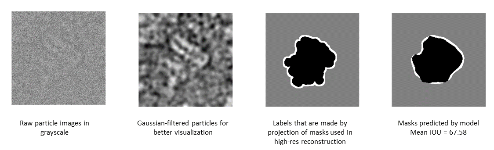

# particleSeg
`particleSeg` is a deep learning-based segmentation tool for cryo-EM particles. It quickly and accurately segments a cryo-EM particle into three parts: signal, background, and edge. Preliminary draft of the manuscript is available [here](Manuscript_particleSeg.pdf).

With the help of the huge cryo-EM database, [EMPIAR](https://www.ebi.ac.uk/empiar/), I gathered a largest quantity of raw particles image as input, and projections from their highest resolution reconstruction as label, trained them accordingly and came up with these [models](models/)

## Workflow
This proposed workflow below can get rid of particles with bad segmentations. Users can choose their desired drop ratio to clean their datasets.


## Installation
1. Make sure you have [conda](https://docs.conda.io/en/latest/miniconda.html), [CUDA](https://developer.nvidia.com/cuda-toolkit)(version >= 11.0), and [cuDNN](https://developer.nvidia.com/cudnn) installed
2. Clone this repo:
```
git clone https://github.com/nzhou26/particleSeg
```
3. Create conda environment
```
conda env create -f env_particleSeg.yml
```
4. Install dependencies from pip
```
# activate the environment just installed
conda activate particleSeg

# install dependencies using pip
pip install -r requirement.txt

# install tensorflow_example from github
pip install -q git+https://github.com/tensorflow/examples.git
```
## Inference Usage
```
usage: segParticles.py [-h] [-i INPUT_STAR] [-r RAW_DATA] [-d DROP_RATIO] [-c]

ParticleSeg: Segment your particles

optional arguments:
  -h, --help            show this help message and exit
  -i INPUT_STAR, --input_star INPUT_STAR
                        Take a metadata(starfile) and return cleaned metadata.
  -r RAW_DATA, --raw_data RAW_DATA
                        Take raw data directory(where *.mrcs stored) if metadata for inference is provided.
  -d DROP_RATIO, --drop_ratio DROP_RATIO
                        Ratio of the particles to be dropped
  -c, --continue        continue inference from current tmp files
```
Segment your particles and drop 30% of them that have the lowest ETS score.
```
python segParticles.py -i /path/to/your/particles.star -r /path/to/your/raw/ -d 0.3
```
After this inference, a new star file will be generated in the same folder as your input star file.
## Train
There are some base pre-trained models from tensorflow application that can be directly used as down stack for the U-Net model.
```
base_models = [
  'custom',
  'DenseNet121',
  'DenseNet169',
  'DenseNet201',
  'EfficientNetB0',
  'ResNet101'
]
```
To train all or a specific model:
```
# train model available pre-trained models, including custom
python train.py all
# train a specific model
python train.py DenseNet121
```
## Getting Help
Training data available upon request.

For any questions, please contact nzhou26@outlook.com 
