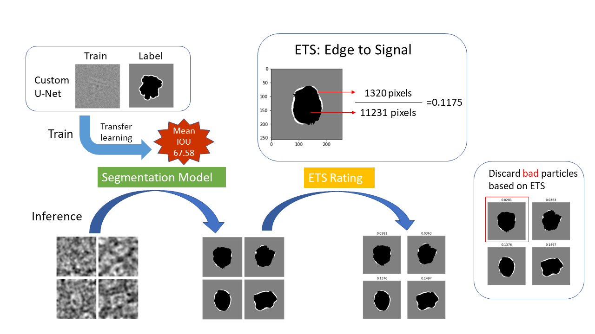

# particleSeg
`particleSeg` is a deep learning-based segmentation tool for cryo-EM particles.


## Installation
```
conda 
## Usage
```
usage: segParticles.py [-h] [--train TRAIN] [--infer INFER] [--raw_data RAW_DATA]

ParticleSeg: Segment your particles

optional arguments:
  -h, --help           show this help message and exit
  --train TRAIN        Train models with current dataset.
  --infer INFER        Take a metadata(starfile) and return cleaned metadata.
  --raw_data RAW_DATA  Take raw data directory if metadata for inference is provided.```

```
## Pretrained custom models
```
base_models = [
  'custom',
  'DenseNet121',
  'DenseNet169',
  'DenseNet201',
  'EfficientNetB0',
  'ResNet101'
]
```
